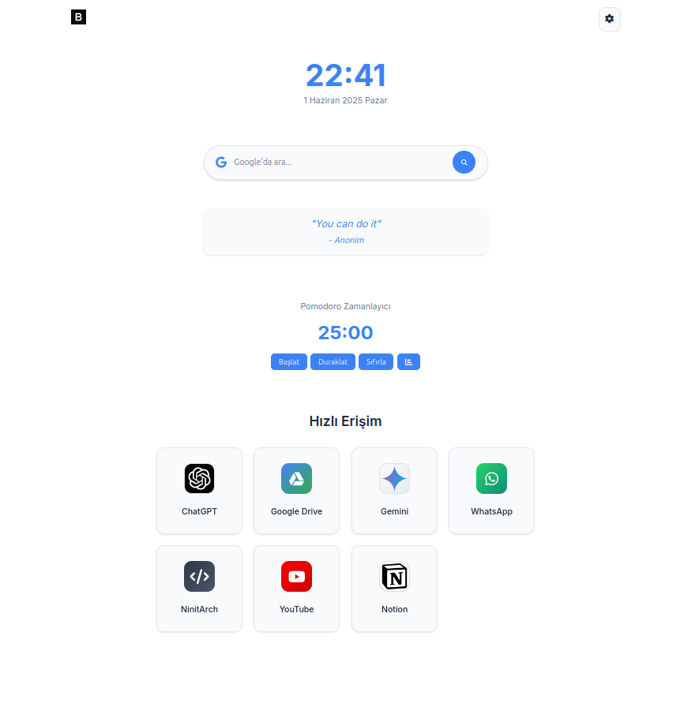
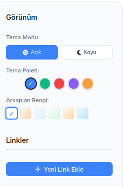
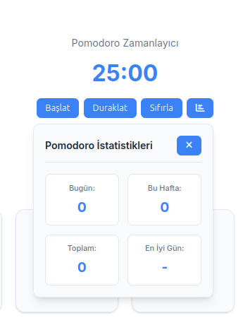

# Ana Sayfa

Ana Sayfa, kişisel bir başlangıç sayfası olarak tasarlanmış, kullanıcı dostu bir web uygulamasıdır. Bu proje, hızlı erişim bağlantıları, tema ve arkaplan özelleştirme, pomodoro zamanlayıcı, motivasyon sözleri ve daha fazlasını içerir. Kullanıcıların günlük ihtiyaçlarını karşılamak için tasarlanmıştır.

## Özellikler

### 1. Tema Yönetimi
- Açık ve koyu tema seçenekleri.
- Tema paleti özelleştirme.
- Arkaplan renklerini değiştirme.

### 2. Hızlı Erişim Linkleri
- Önceden tanımlı bağlantılar (ChatGPT, Google Drive, YouTube vb.).
- Kullanıcı tarafından özelleştirilebilir bağlantılar.
- Bağlantıları düzenleme, silme ve sürükleyip bırakma desteği.

### 3. Pomodoro Zamanlayıcı
- 25 dakikalık varsayılan zamanlayıcı.
- Başlat, duraklat ve sıfırla seçenekleri.
- Günlük, haftalık ve toplam pomodoro istatistikleri.

### 4. Motivasyon Sözleri
- Günlük motivasyon sözü gösterimi.
- Sözlerin rastgele seçimi.

### 5. Google Arama
- Hızlı Google arama özelliği.
- Klavye kısayolları ile arama kutusuna hızlı erişim.

### 6. Arkaplan Yönetimi
- Varsayılan, sıcak, soğuk, doğa, gün batımı ve okyanus gibi arkaplan seçenekleri.
- Tema moduna göre arkaplan renklerinin otomatik uyumu.

### 7. Klavye Kısayolları
- `Shift + K` veya `Meta + K`: Arama kutusuna odaklanma.
- `Shift + ,` veya `Meta + ,`: Ayarlar panelini açma/kapatma.
- `Escape`: Ayarlar panelini kapatma.

## Kullanım

### 1. Tema ve Arkaplan Özelleştirme
- Sağ üstteki ayarlar simgesine tıklayın.
- Tema modu, palet ve arkaplan seçeneklerini değiştirin.

### 2. Link Yönetimi
- Yeni bir bağlantı eklemek için "Yeni Link Ekle" butonuna tıklayın.
- Bağlantıları düzenlemek veya silmek için bağlantı kartındaki düzenleme ve silme butonlarını kullanın.
- Bağlantıları sürükleyip bırakarak sıralamalarını değiştirin.

### 3. Pomodoro Zamanlayıcı
- Zamanlayıcıyı başlatmak için "Başlat" butonuna tıklayın.
- Duraklatmak için "Duraklat" butonunu kullanın.
- Sıfırlamak için "Sıfırla" butonuna tıklayın.
- İstatistikleri görmek için grafik simgesine tıklayın.

### 4. Google Arama
- Arama kutusuna bir sorgu yazın ve "Ara" butonuna tıklayın veya `Enter` tuşuna basın.

## Kurulum

### Gereksinimler
- Modern bir web tarayıcısı (Chrome, Firefox, Edge, Safari vb.).

### Adımlar
1. Bu projeyi klonlayın:
    ```bash
    git clone https://github.com/brky06/AnaSayfa.git
    ```
2. Proje dizinine gidin:
    ```bash
    cd AnaSayfa
    ```
3. `index.html` dosyasını tarayıcınızda açarak uygulamayı çalıştırın.

## Dosya Yapısı

```
AnaSayfa/
├── index.html       # Ana HTML dosyası
├── style.css        # Uygulama için stil dosyası
├── script.js        # Uygulama için JavaScript dosyası
├── README.md        # Proje açıklama dosyası
├── favicon.ico      # Site simgesi
```

## Katkıda Bulunma

1. Bu projeyi forklayın.
2. Yeni bir dal oluşturun (`git checkout -b yeni-ozellik`).
3. Değişikliklerinizi yapın ve commit edin (`git commit -m 'Yeni özellik ekle'`).
4. Dalınızı push edin (`git push origin yeni-ozellik`).
5. Bir pull request açın.

## Lisans

Bu proje MIT Lisansı altında lisanslanmıştır. Daha fazla bilgi için lisans dosyasını inceleyin.

## Ekran Görüntüleri

### Ana Sayfa


### Tema ve Arkaplan Özelleştirme


### Pomodoro Zamanlayıcı


---

Bu proje hakkında herhangi bir sorunuz varsa, lütfen [brky06](https://github.com/brky06) ile iletişime geçin.
